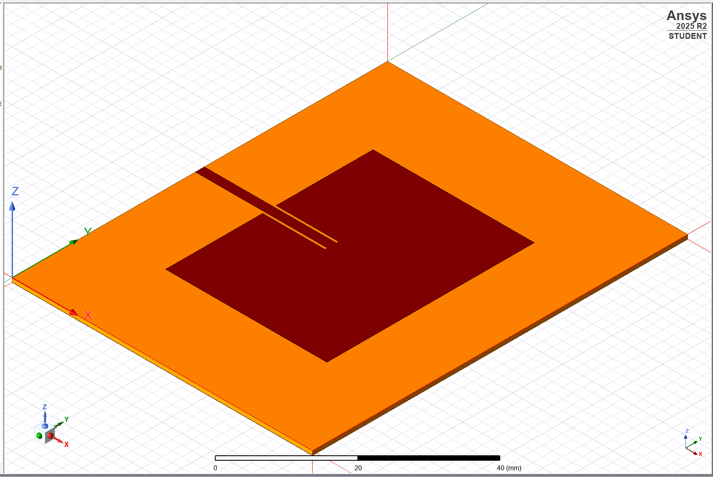
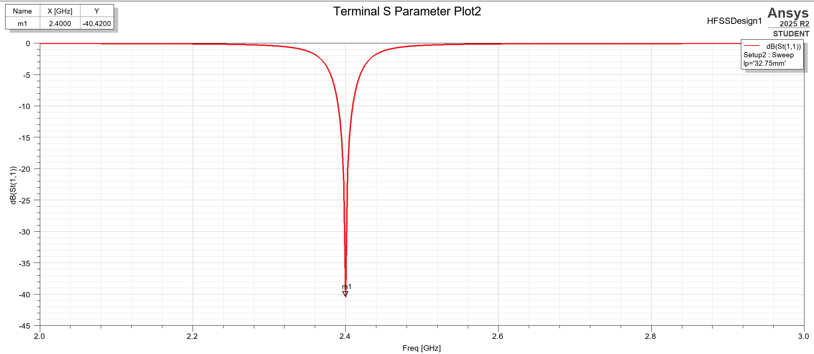
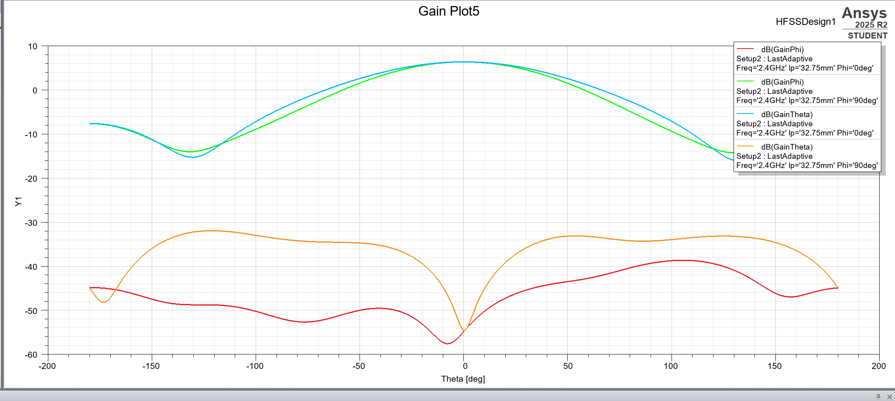
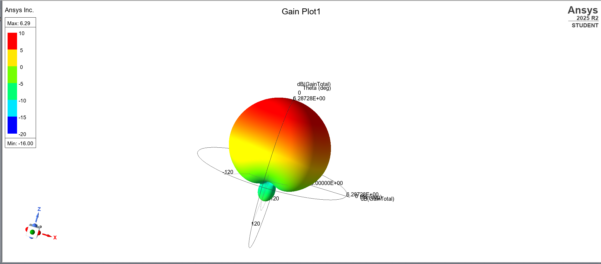

# 2.4-GHz Rectangular Microstrip Antenna (MSA) on ROGERS RO4003

## Overview

This project contains the design and electromagnetic simulation of a **2.4 GHz rectangular microstrip antenna (MSA)** fabricated on **ROGERS RO4003** substrate material. The antenna design is optimized for high-frequency performance with excellent dielectric stability and low loss characteristics.

## Substrate Specifications

| Property                       | Value          | Units            |
| ------------------------------ | -------------- | ---------------- |
| **Substrate**                  | Rogers RO4003C | -                |
| **Relative Permittivity (εr)** | 3.55 ± 0.05    | @ 10 GHz         |
| **Loss Tangent (tan δ)**       | 0.0027         | @ 10 GHz         |
| **Substrate Thickness**        | 0.787          | mm (31 mil)      |
| **Copper Thickness**           | 0.035          | mm (35 µm)       |
| **Operating Frequency**        | 2.4            | GHz              |

## Antenna Specifications

### Design Parameters

- **Center Frequency**: 2.4 GHz
- **Bandwidth**: ISM band (2.4-2.5 GHz)
- **Antenna Type**: Rectangular Microstrip Patch
- **Feed Method**: Microstrip line feed
- **Polarization**: Linear

### Measured Performance Results

- **Return Loss (S11)**: **-40 dB @ 2.4 GHz** ✓
- **Peak Gain**: **6.28 dBi** ✓
- **Resonant Frequency**: 2.4 GHz
- **Radiation Pattern**: Broadside radiation
- **Efficiency**: Excellent (low-loss substrate)

## Design Visualization

### Antenna Design

### S11 Return Loss

### Antenna Gain

### Radiation Pattern

## Key Advantages of ROGERS RO4003

- **Low Dielectric Loss**: Improves radiation efficiency and overall antenna performance
- **Stable Dielectric Constant**: Ensures consistent resonant frequency and impedance
- **Excellent RF Performance**: Optimized for 2.4 GHz ISM band applications
- **Higher Antenna Efficiency**: Significantly better performance than FR4 substrate

## Applications

- WiFi/WLAN Devices (2.4 GHz band)
- Bluetooth modules and IoT devices
- Wireless sensors and communication systems

## Files

- **Design/MSA2.aedt**: ANSYS HFSS design file with complete antenna geometry
- **Design/MSA2.aedtresults/**: Simulation results and electromagnetic field data
- **Images/**: Design, S11, Gain, and Radiation Pattern visualizations
- **Report/**: Detailed analysis and measurements
